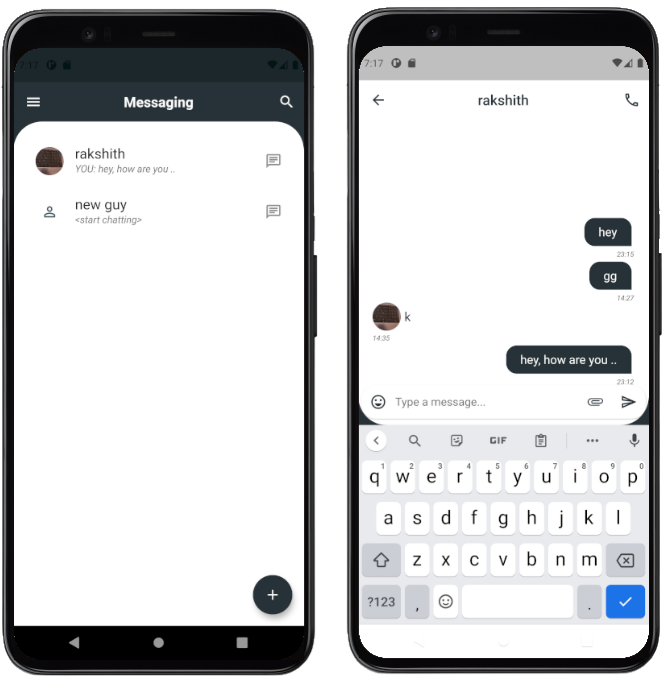

# Flutter Chat app

Basic Flutter-Firebase chatting application with few cool features.
Based on this [design idea](https://search.muz.li/NDdkNDdkYmJj)

## Features

 - Signup/Login with emailID and password
 - Auto update of contact/users list when new people register or update
 - chat auto scroll on new message arival
 - Emoji keyboard
 - Profile photo selection from camera or gallary
 - Update display Name option
 - Random background image (only visible to you in drawer screen)
 - Notifications on new massages using FCM
 - Store user list and meta information on device disk

for all images checkout `screenshots` folder.

## Getting Started

 - Create new flutter project and paste these files in the project folder.
 - Copy `dependencies`, `dev_dependencies` and `assets` sections from pubspec.yaml to pubspec.yaml file in new project.
 - Create a Firebase account and create a new project and follow instructions [here](https://firebase.flutter.dev/docs/overview/) to setup firebase android/ios configs in your project
 - Firebase services used - `Authentication`, `Firestore`, `Storage`, `Cloud Messaging`
 - Enable FCM and copy generated authServerKey into push_notifications.dart for enabling push notifications.